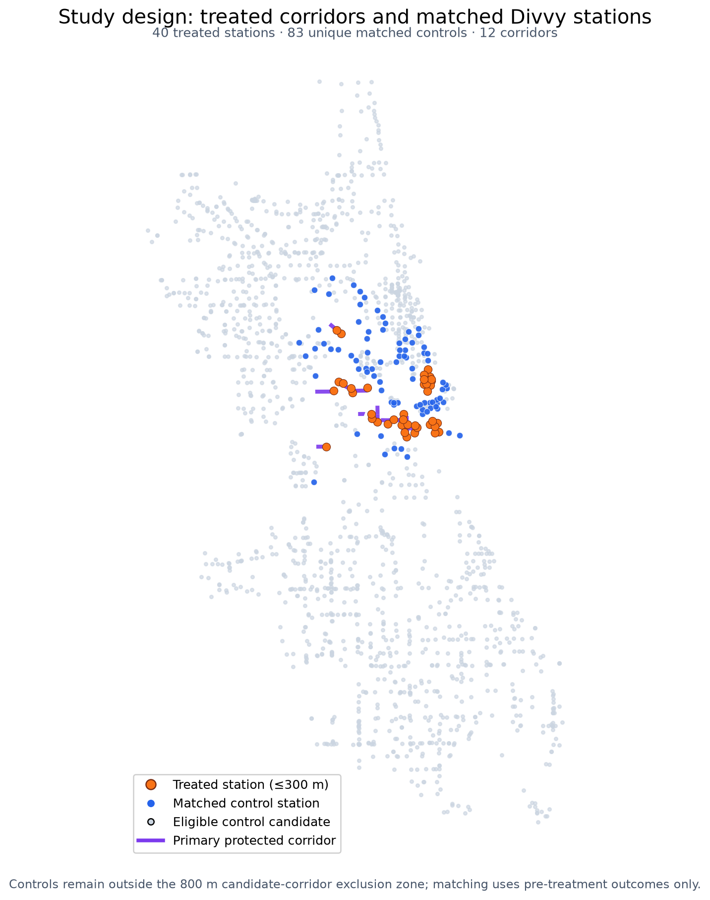
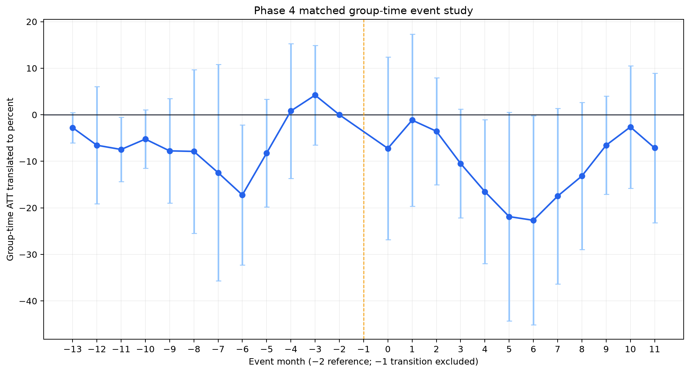
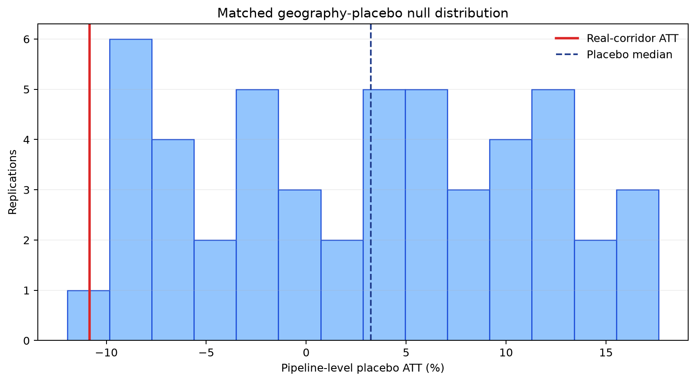

# Protected Bike Lanes and Divvy Ridership

An end-to-end causal-inference case study asking whether newly completed protected bike-lane corridors changed monthly Divvy trip starts at nearby Chicago stations.

## Bottom line

The primary matched group-time estimate is **−10.8%** with a 95% confidence interval of **−24.0% to 2.3%**. The interval includes zero, so the analysis **does not establish that the installations increased nearby Divvy trip starts**. It also does not support a clean claim that the lanes caused a decrease: pre-treatment leads are imperfect, treatment dates are only medium-confidence, cohort effects are heterogeneous, and the real estimate does not reach the locked tail criterion in the matched geography placebo.

| Decision point | Result |
|---|---|
| Phase 3 identification gate | `PASS WITH LIMITATIONS` |
| Primary group-time ATT | **−10.8%** (95% CI **−24.0%, 2.3%**) |
| Cohort-stacked PPML | −4.8% (95% CI −18.6%, 11.2%) |
| Phase 5 robustness gate | `PASS WITH LIMITATIONS` |
| Final claim | No increase established; no unconditional causal claim |



## Study design

- **Outcome:** monthly trips starting at a Divvy station, split secondarily into member and casual trips.
- **Treatment:** first verified full month after a corridor gained physical bike-lane protection; the completion month is excluded as transition.
- **Sample:** 12 corridors, 40 treated stations within 300 m, and 120 cohort-control assignments representing 83 unique controls.
- **Panel:** July 2023–June 2026, with a complete 12-month pre-period and 12-month post-period for every selected station/cohort.
- **Controls:** three cohort-local controls per treated station, selected without replacement within cohort using only pre-treatment ridership level, slope, variability, and member share.
- **Primary estimator:** matched group-time ATT for staggered adoption, translated from counts to percent of the estimated treated counterfactual mean.
- **Inference:** two-way clustered by treated corridor and reused control station; t critical values use 11 corridor degrees of freedom.

The design, thresholds, estimator roles, and change-control rules were locked before the corresponding treatment effects were read. See the [research brief](docs/research_brief.md) and [execution plan](docs/project_plan.md).

## Main result

The group-time ATT is the headline because severe cohort heterogeneity and two single-corridor cohorts make PPML ineligible under the pre-specified estimator registry. The group-time and PPML samples reconcile and their confidence intervals overlap; the estimator choice was not based on which result looked more favorable.



The event study also shows why the interpretation remains narrow. A four-bin test of pre-treatment placebo leads rejects exact zero (`F(4,11) = 4.41`, `p = 0.023`), although the largest individual lead (−16.3%) remains below the locked 20% automatic-failure materiality threshold. Phase 3 therefore authorized estimation only with explicit limitations.

Full estimator results are in [reports/phase4_results.md](reports/phase4_results.md).

## Robustness and falsification

The substantive direction is stable across several planned alternatives, but not every falsification criterion clears:

| Check | Result |
|---|---|
| Treated/donut radii | −10.7% to −12.1% |
| Exclude first one or two post months | −11.2% and −12.1% |
| New protected lanes only | −8.6% (95% CI −25.6%, 8.4%) |
| Member / casual outcomes | −12.7% / −6.9% |
| Leave one corridor out | −15.0% to −5.8%; Halsted/Roosevelt/Van Buren is influential |
| Fake date six months early | +2.4% (95% CI −5.1%, 10.0%) |
| 50 matched geography placebos | Null median +3.2%; empirical two-sided tail probability 0.235 |



The fake-date result does not reproduce the main estimate. The geography placebo is less reassuring: the real −10.8% estimate is outside the placebo central 90% interval on the negative side, but its fixed-seed empirical tail probability is 0.235 rather than the locked 0.10 threshold. That failure is retained in the final claim rather than tuned away.

Full robustness results are in [reports/phase5_robustness.md](reports/phase5_robustness.md).

## Limitations

- **Outcome scope:** Divvy trip starts are not total cycling, corridor counts, safety, or welfare.
- **Targeting:** lanes may have been placed where ridership was already changing; matching cannot remove unobserved targeting.
- **Pre-treatment evidence:** placebo leads reject exact zero, so parallel trends remain uncertain.
- **Timing:** all treatment dates are medium-confidence first-verified months; shifting conservative dates one month earlier changes interval classification.
- **Spillovers and exposure:** controls may experience network spillovers, and eight treated stations are near multiple eligible corridors.
- **Station measurement:** monthly station coordinates are unavailable, so relocations inside the panel cannot be fully reconstructed.
- **Few corridors:** there are 12 independent treatment clusters, four represented by one treated station, with severe cohort heterogeneity.
- **Placebo coverage:** the candidate inventory is a concurrent-project proxy rather than a complete registry of every Chicago transport project.

## Reproduce the analysis

Python 3.11+ is required. The two Project A Parquet products are intentionally ignored by Git; copy them into the repository before running the build.

```text
data/input/station_master.parquet
data/input/station_month_panel.parquet
```

Then run:

```bash
make setup
make reproduce
```

`make reproduce` rebuilds the treatment audit, spatial panel, matched controls, identification gate, main estimators, all Phase 5 sensitivities, 50 fixed-seed geography placebos, release figure, and 28 automated tests. No missing station-month is converted to zero. Derived Parquet files remain local and ignored by Git.

Useful shorter checkpoints:

```bash
make phase2       # audited spatial station-month panel
make phase3       # matching, pre-treatment diagnostics, identification gate
make phase4       # group-time ATT, event study, PPML, estimator registry
make phase5       # robustness and falsification
make release      # portfolio asset and release-contract checks
```

## Repository guide

```text
config/analysis.json              Locked design and robustness registry
data/reference/                   Audited corridor inventory and geometry
src/bikelane_causal/pipeline.py   Spatial assignment and panel construction
src/bikelane_causal/diagnostics.py
src/bikelane_causal/estimation.py
src/bikelane_causal/robustness.py
src/bikelane_causal/release.py    Final map and release checks
reports/                          Gate decisions, tables, and figures
tests/                            Phase-specific data and analysis contracts
```

For technical review, read the [research memo](docs/research_memo.md). For the exact language allowed in presentations and interviews, see the [claims audit](docs/claims_audit.md).
