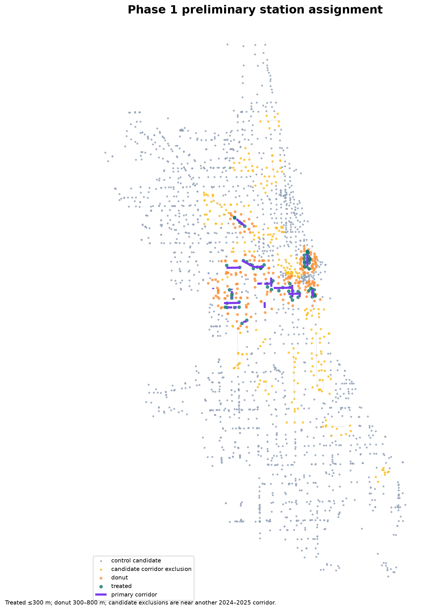

# Phase 1 Feasibility Report

**Decision:** `PASS WITH LIMITATIONS`  
**Decision date:** 2026-07-20  
**Outcome effects estimated:** none

## Executive finding

Chicago can support the planned Project B design, but timing precision and treatment concentration must remain visible throughout the analysis. The audit found 12 usable independent corridors, 40 stable treated stations with complete 12-month pre and post windows, and 1,599 preliminary control candidates after excluding stations near other 2024–2025 candidate corridors. The largest corridor contains 27.5% of stable treated stations. A conservative power calculation implies a minimum detectable change of roughly 14–20%.

The pass is conditional rather than clean because nine corridors use a conservative first-verified month rather than an exact opening month, three treated stations are exposed to nearby corridors with different completion months, and Project A does not contain monthly station coordinates for a full relocation audit.

## Candidate-universe audit

- 52 official CDOT source segments: 37 installed in 2024 and 15 installed in 2025.
- 47 independent candidate corridors after consolidating same-project segments on 16th, Halsted, Homan, and Jackson.
- 44 candidate corridor geometries matched to the official current bike-route layer.
- Three non-primary candidates remain unmatched: Commercial (93rd–90th), Ainslie (Lincoln–Western), and Logan Square. They cannot enter an analysis until their geometry is resolved.
- 17 corridors have medium-confidence usable months and verified geometry. Five of them have no stable Divvy station within 300 m, leaving 12 usable treatment corridors.

The official tracker establishes installation year, facility type, limits, and status but not month. Exact or bracketed month evidence comes from dated corridor-specific sources. For nine 2024 corridors, CDOT's installed-year record is paired with the [Bike Lane Fest field audit](https://chi.streetsblog.org/2025/01/02/part-4-of-sbcs-bike-lane-fest-2024-west-side), whose fieldwork was completed on 2024-12-28/2025-01-01. December is therefore stored as a conservative first verified usable month, not represented as the true opening month.

## Locked treatment rules

1. Treatment requires physical separation, not an announcement or construction start.
2. `new_protected` and `protection_upgrade` remain distinct. Both enter the primary feasibility sample; `new_protected` only is a required robustness sample.
3. The verified completion month is excluded as a transition period. The following month is the first post-treatment month.
4. A station within 300 m of multiple eligible corridors receives the earliest valid treatment month; ties go to the nearest corridor.
5. Low-confidence dates, unmatched geometry, and corridors with no stable station inside 300 m are excluded from the primary analysis.

## Usable design

| Corridor | Verified month | Stable treated stations |
|---|---:|---:|
| Clark, Grand–Oak | 2024-07 | 11 |
| Grand, Chicago–Damen | 2024-07 | 5 |
| Franklin, Central Park–Sacramento | 2024-10 | 1 |
| Halsted, Roosevelt–Van Buren | 2024-11 | 5 |
| Milwaukee, California–Logan | 2024-12 | 2 |
| Wabash, Roosevelt–Balboa | 2024-12 | 6 |
| 16th, Central Park–Kedzie | 2024-12 | 1 |
| Canal, Roosevelt–Taylor | 2024-12 | 1 |
| Harrison, Ashland–Halsted | 2024-12 | 2 |
| Jackson, Oakley–Ogden | 2024-12 | 2 |
| Paulina, Congress–Warren | 2024-12 | 1 |
| Taylor, Morgan–Canal | 2024-12 | 3 |
| **Total** |  | **40** |

Five dated corridors were removed from the usable sample because no station within 300 m has all 12 required pre and 12 required post months: 24th, Douglas, Damen, Homan, and Keeler.

Treatment timing is concentrated. Sixteen stable stations belong to the July 2024 cohort and 18 belong to the December 2024 cohort; the remaining six belong to October and November. The estimators therefore have 12 corridor clusters but only four usable timing cohorts. Phase 4 inference must reflect the corridor count and must not describe the design as having 12 independent timing shocks.

## Geometry and station assignment

All 17 dated corridor geometries reconcile with CDOT tracker lengths; relative length discrepancies range from approximately 0.1% to 9.0%. Distances were computed in EPSG:26916, a meter-based projected CRS.

Preliminary station classification:

- 73 stations within 300 m of a dated primary corridor.
- 40 stations retain complete 12/12 windows and enter the preliminary primary sample.
- 205 stations in the 300–800 m exclusion donut.
- 277 additional stations excluded because they lie within 800 m of another matched 2024–2025 candidate corridor.
- 1,599 preliminary control candidates.
- Nine treated stations lie within 300 m of more than one eligible corridor; three of those nearby corridors have different verified months. The earliest-treatment rule resolves timing, while the overlap flag remains available for sensitivity analysis.



## Station integrity

Stability requires every one of the 12 pre and 12 post months to be observed; a missing station-month is never converted automatically to zero. None of the 40 preliminary treated stations shares its normalized station name with a second station ID. Across the full station universe, 110 records have a same-name/multiple-ID flag and must remain subject to the Phase 2 mapping rules.

Project A contains a single latitude/longitude record per station, not a coordinate history by month. Stable IDs and complete observation windows can therefore be audited now, but an unrecorded within-ID relocation cannot be ruled out. This is one reason for the conditional pass.

## Control credibility screen

Every dated corridor has at least 12 complete local control stations between 0.8 and 3 km after candidate-corridor exclusions. The median absolute treated-versus-local pre-period slope gap is 1.18 percentage points per month on the log-trip scale.

This screen does not establish parallel trends. The 16th Street corridor has only one stable treated station and a 5.07 percentage-point monthly slope gap, making it an explicit Phase 3 diagnostic target. It cannot be removed based on a favorable or unfavorable post-treatment result; any exclusion must follow the pre-treatment diagnostic rule and be reported.

## Planning power audit

The power calculation uses 608 stations observed in all 36 months. Monthly `log1p(total_trips)` was residualized by station and calendar month, producing a residual standard deviation of 0.319 and median station AR(1) of 0.579. With 12 usable corridor clusters, 12 pre months, 12 post months, 80% power, a two-sided 5% test, and assumed within-corridor ICC values from 0.10 to 0.50, the approximate MDE is:

| Assumed within-corridor ICC | Approximate MDE |
|---:|---:|
| 0.10 | 14.4% |
| 0.30 | 17.1% |
| 0.50 | 19.5% |

This is a planning calculation, not a promise of estimator precision. Effects smaller than roughly the mid-teens may be difficult to distinguish from noise with the available corridor count.

## Exit-gate decision

| P1 criterion | Result | Decision |
|---|---|---|
| At least 8 independent dated corridors | 12 usable medium-confidence corridors | PASS |
| At least 20 stable treated stations | 40 | PASS |
| Mostly 12 pre and 12 post months | Required for every primary station | PASS |
| No corridor above roughly 30% | Maximum 27.5% | PASS |
| Geometry and assignment checks | 17/17 dated geometries reconcile; map reviewed | PASS WITH LIMITATIONS |
| Plausible detectable effect | Approximate MDE 14–20% | PASS WITH LIMITATIONS |

**Final P1 decision: `PASS WITH LIMITATIONS`.** Phase 2 may begin. It must preserve date confidence, multiple exposure, same-name ID flags, candidate-corridor exclusions, and the distinction between exact and conservative first-verified timing. No causal headline is authorized until the Phase 3 identification gate passes.

## Reproduction

From the project root:

```bash
python3 -m venv .venv
.venv/bin/python -m pip install -r requirements-phase1.txt
MPLCONFIGDIR=.scratch/matplotlib .venv/bin/python scripts/build_phase1_audit.py
```

The script creates the corridor inventory, preliminary station assignment, geometry audit, pre-trend screen, power audit, map, and machine-readable Phase 1 summary without estimating a treatment effect.
