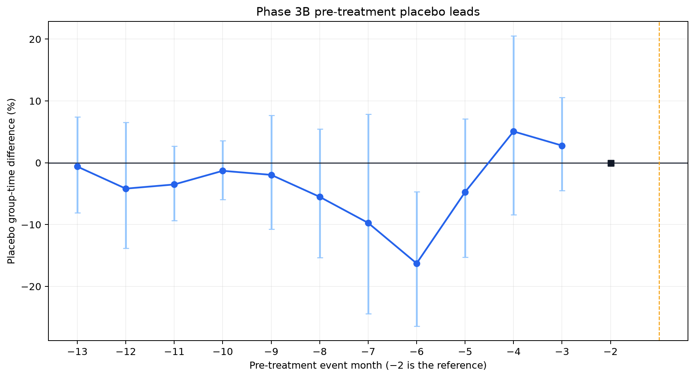

# Phase 3B Identification Decision

**Exit-gate decision:** `PASS WITH LIMITATIONS`  
**Primary control specification:** pre-period matched cohort-local controls  
**Phase 4 causal estimation authorized:** yes

## Locked design

For each treatment cohort, begin with never-treated controls that have all 12 pre and 12 post months. Restrict them to stations within 3 km of a corridor treated in that cohort and outside the 800 m exclusion zone around every candidate corridor. Match 3 unique controls to each treated station, without replacement within cohort, using only the 12 pre-treatment months: mean, slope, variability of `log(1 + total trips)`, and member-trip share.

The resulting 120 cohort-control assignments are frozen in `reports/phase3_control_matches.csv` (SHA-256 `b7ef2ae6ac87957a3199b45ded4a4409cdb903929190299886e407e34141c11e`). Phase 4 must use this sample for the primary group-time ATT and staggered-robust PPML comparison. Broad and cohort-local pools remain sensitivity specifications only.

## Gate evidence

- Treated-station-weighted matched pre-trend gap: 0.21 percentage points per month.
- Locked failure threshold: 2.00 percentage points per month in absolute value.
- All selected cohort windows complete: true.
- Unique matched controls within cohort: true.
- Matching used post-treatment outcomes: false.
- Four-bin pre-treatment lead diagnostic: F(4, 11) = 4.41, p = 0.023.
- Largest absolute placebo lead: 16.3%.
- Lead inference clusters: 12 treated corridors and 83 control stations.
- Locked lead failure rule: joint `p < 0.05` and at least one absolute lead of 20% or more. The joint test triggers, but the largest lead remains below that materiality threshold; it is therefore a limitation rather than an automatic failure.

### Hard failures

- None.

### Limitations carried into Phase 4 and the final claim

- Matched pre-period covariate balance remains weak for cohort(s): 2024-11, 2024-12.
- the four-bin pre-treatment placebo-lead test rejects exact zero; this is a material identification limitation.
- 4 corridor(s) are represented by only one treated station.
- all treatment dates are first-verified months with medium confidence.
- 8 treated stations have multiple corridor exposure.

### Corridor pre-trend warnings

- None.

## Interpretation

`PASS WITH LIMITATIONS` means the locked matched design may proceed to Phase 4, but the evidence is not equivalent to proof of parallel trends. Timing uncertainty, sparse corridors, multiple exposure, and flagged corridor heterogeneity must remain visible in the main tables and sensitivity analysis. No corridor may be removed because its post-treatment estimate is inconvenient; any leave-one-corridor-out results belong in Phase 5.
