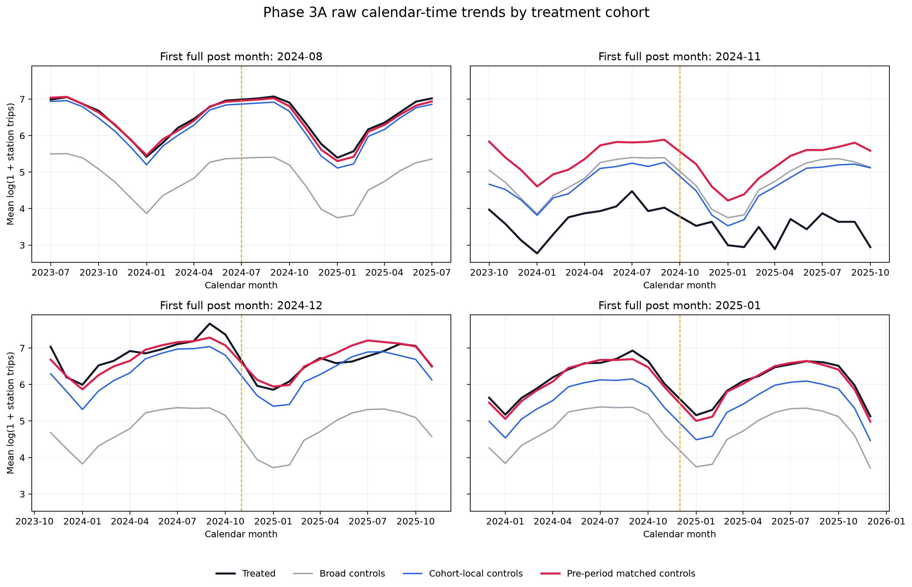
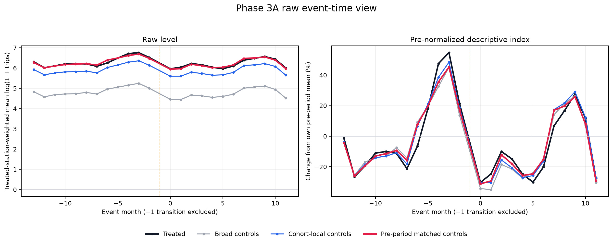

# Phase 3A Diagnostic Report

**Checkpoint:** `COMPLETE`  
**Causal treatment effect estimated:** no  
**Outcome used for diagnostics:** `log(1 + total station trips)`

## What is frozen before Phase 3B

- Broad controls are never-treated stations with a complete cohort-specific 12-month pre and 12-month post window.
- Cohort-local controls are broad controls within 3 km of a corridor treated in that cohort. All were already outside the 800 m exclusion donut around every 2024–2025 candidate corridor.
- Pre-period matched controls are selected only from the cohort-local pool using four 12-month pre-treatment features: mean, linear slope, variability of `log(1 + trips)`, and member-trip share.
- Matching is 3:1 without replacement within cohort. No post-treatment outcome enters control selection.

## Cohort comparison

The descriptive slope is the monthly linear trend in the treated-minus-control raw mean-log series over event months −13 through −2. Its p-value in the CSV is descriptive only; the Phase 3 gate does not treat it as a causal test.

| First post | Pool | Treated | Controls | Slope gap (pp/month) | Centered RMSE | Max abs SMD |
|---|---|---:|---:|---:|---:|---:|
| 2024-08 | broad | 16 | 391 | 0.58 | 0.057 | 0.87 |
| 2024-08 | cohort_local | 16 | 82 | 0.39 | 0.058 | 0.42 |
| 2024-08 | pre_period_matched | 16 | 48 | 0.38 | 0.047 | 0.37 |
| 2024-11 | broad | 1 | 403 | -2.25 | 0.185 | 0.99 |
| 2024-11 | cohort_local | 1 | 22 | -2.50 | 0.192 | 0.97 |
| 2024-11 | pre_period_matched | 1 | 3 | 1.11 | 0.210 | 2.13 |
| 2024-12 | broad | 5 | 408 | -1.67 | 0.243 | 1.13 |
| 2024-12 | cohort_local | 5 | 43 | -2.64 | 0.232 | 0.89 |
| 2024-12 | pre_period_matched | 5 | 15 | -0.20 | 0.175 | 1.13 |
| 2025-01 | broad | 18 | 406 | 1.00 | 0.102 | 0.75 |
| 2025-01 | cohort_local | 18 | 106 | 0.63 | 0.087 | 0.44 |
| 2025-01 | pre_period_matched | 18 | 54 | 0.12 | 0.084 | 0.07 |

## Treated-station-weighted aggregate pre-trends

- Broad controls: 0.41 percentage points per month.
- Cohort-local controls: 0.05 percentage points per month.
- Pre-period matched controls: 0.21 percentage points per month.

## Composition

- Treated stations: 40 across 12 corridors and 4 cohorts.
- Every selected treated and control station has all 12 pre and 12 post outcome months for its cohort.
- Matched control rows: 120; unique within each cohort by construction.
- The transition month (`event_time = -1`) is excluded from every diagnostic series and from the later estimation sample.

## Figures

## Interpretation boundary

These figures reveal raw post-treatment outcomes but do not estimate an ATT, adjust for sampling uncertainty, or authorize a causal headline. Phase 3B must read the full cohort and corridor diagnostics, lock the control specification, and record the identification decision before Phase 4 begins.
