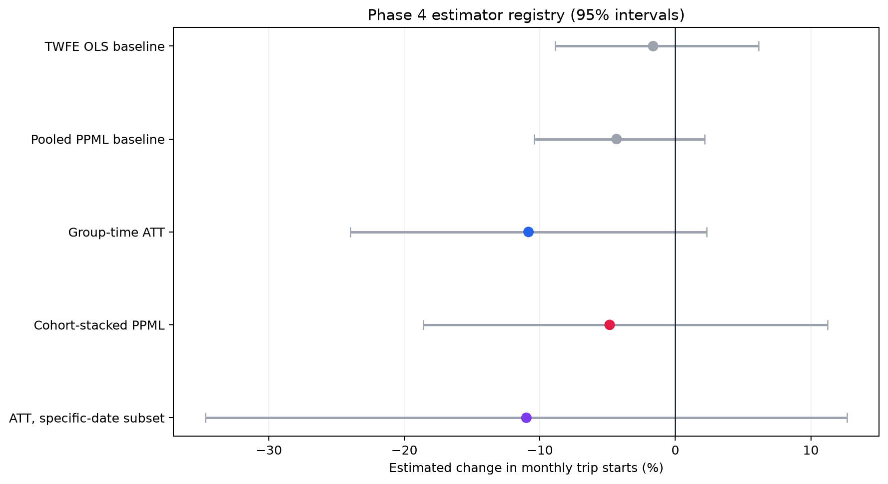

# Phase 4 Main Estimation Results

**Exit-gate decision:** `PASS`  
**P3 identification status carried forward:** `PASS WITH LIMITATIONS`  
**Headline estimator selected by the locked rule:** `group_time_att`

## Results registry

| Estimator | Role | Effect | 95% interval |
|---|---|---:|---:|
| `twfe_ols_log1p_baseline` | transparency baseline; never headline | -1.6% | [-8.9%, 6.2%] |
| `pooled_ppml_twfe_baseline` | transparency baseline; never headline | -4.3% | [-10.4%, 2.2%] |
| `group_time_att` | primary identification and dynamics | -10.8% | [-24.0%, 2.3%] |
| `cohort_stacked_ppml` | conditional headline percentage magnitude | -4.8% | [-18.6%, 11.2%] |
| `group_time_att_specific_timing` | required specific-date sensitivity | -11.0% | [-34.7%, 12.7%] |

The group-time ATT is estimated on monthly trip counts using the last non-transition pre-month (`event_time = -2`) as the universal base. Its count ATT is translated to a percentage of the estimated treated counterfactual mean. This is the matched-panel group-time implementation of the Callaway–Sant’Anna identification logic with never-treated controls; no post-treatment outcome enters matching. Cohort-stacked PPML uses the identical 40 treated stations, 120 matched control assignments, four cohorts, and 24 analysis months, with stack-station and stack-calendar fixed effects. Its percentage is `100 × (exp(β) − 1)`.

Main uncertainty is two-way clustered by treated corridor and reused control station, with t critical values based on 11 corridor degrees of freedom. Baseline models are station-clustered and remain transparency checks only.

## Headline rule and reconciliation

- Main samples reconcile: true.
- CS cohort heterogeneity severe: true; range 61.8 pp; formal few-cluster inference is not reliable because at least one cohort has only 1 treated corridor.
- PPML cohort heterogeneity severe: true; range 33.3 pp; formal few-cluster inference is not reliable because at least one cohort has only 1 treated corridor.
- CS–PPML point gap: 6.0 percentage points; confidence intervals overlap: true.
- Material unresolved divergence: false.

The locked conditions therefore select **group_time_att** at **-10.8%** with a 95% interval of **[-24.0%, 2.3%]**. The interval includes zero. This is not evidence of an increase, and it is not an unconditional causal claim: the P3 placebo-lead warning remains part of the result.

The required specific-date subset removes seven conservative first-verified corridors, retaining 24 treated stations across five corridors. Its estimate is **-11.0%** with a 95% interval of **[-34.7%, 12.7%]**; it is directionally similar but substantially less precise.

## Event study

## Estimator comparison

## Limitations carried into interpretation

- Matched pre-period covariate balance remains weak for cohort(s): 2024-11, 2024-12
- the four-bin pre-treatment placebo-lead test rejects exact zero; this is a material identification limitation
- 4 corridor(s) are represented by only one treated station
- all treatment dates are first-verified months with medium confidence
- 8 treated stations have multiple corridor exposure

The project measures Divvy trip starts near treated corridors, not total cycling. Phase 5 must test radius, control-pool, timing, treatment-variant, outcome, leave-one-corridor-out, and geography-placebo sensitivity before any portfolio conclusion is finalized.
