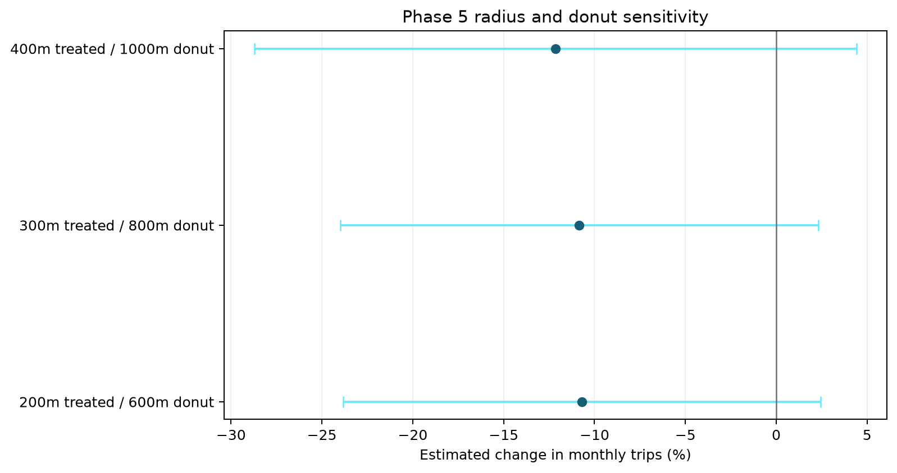
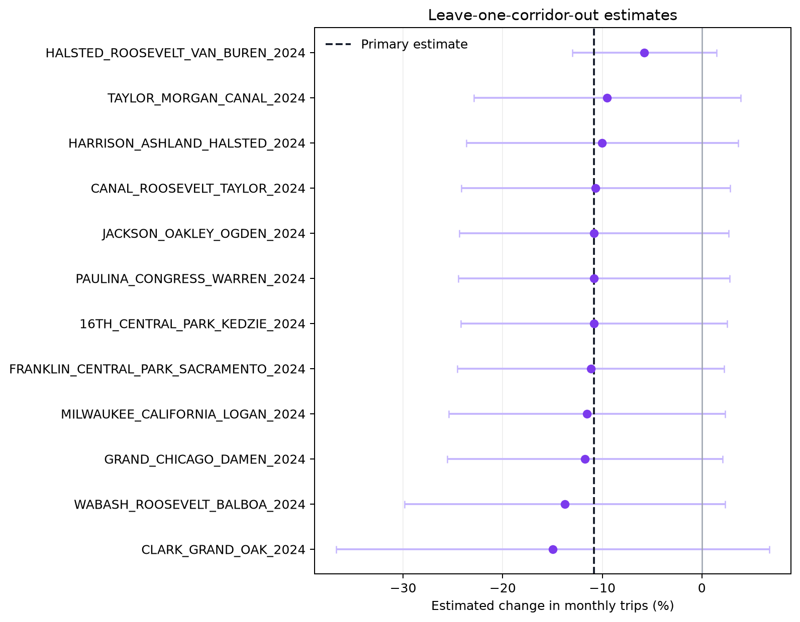

# Phase 5 Robustness and Falsification

**Exit-gate decision:** `PASS WITH LIMITATIONS`  
**Specification lock:** 2026-07-25  
**Primary Phase 4 estimate:** -10.8% (95% CI -24.0% to 2.3%)

## Robustness registry

| Milestone | Specification | Effect (%) | 95% CI | Treated stations | Corridors | Inference |
|---|---|---:|---:|---:|---:|---|
| M5.1 radius | 200m treated / 600m donut | -10.7 | [-23.8, 2.4] | 26 | 11 | two-way clustered 95% CI |
| M5.1 radius | 300m treated / 800m donut | -10.8 | [-24.0, 2.3] | 40 | 12 | two-way clustered 95% CI |
| M5.1 radius | 400m treated / 1000m donut | -12.1 | [-28.7, 4.4] | 53 | 12 | two-way clustered 95% CI |
| M5.2 controls | pre-period matched (primary) | -10.8 | [-24.0, 2.3] | 40 | 12 | two-way clustered 95% CI |
| M5.2 controls | cohort local | -5.0 | [—, —] | 40 | 12 | point estimate only |
| M5.2 controls | broad | -17.2 | [—, —] | 40 | 12 | point estimate only |
| M5.4 construction window | post starts at event +0 | -10.8 | [-24.0, 2.3] | 40 | 12 | two-way clustered 95% CI |
| M5.4 construction window | post starts at event +1 | -11.2 | [-24.2, 1.9] | 40 | 12 | two-way clustered 95% CI |
| M5.4 construction window | post starts at event +2 | -12.1 | [-25.1, 0.9] | 40 | 12 | two-way clustered 95% CI |
| M5.5 treatment variant | new protected only | -8.6 | [-25.6, 8.4] | 30 | 6 | two-way clustered 95% CI |
| M5.6 outcome | member trips | -12.7 | [-28.0, 2.6] | 40 | 12 | two-way clustered 95% CI |
| M5.6 outcome | casual trips | -6.9 | [-15.5, 1.7] | 40 | 12 | two-way clustered 95% CI |
| M5.4 timing sensitivity | conservative dates shifted -1 month | -14.5 | [-27.8, -1.2] | 40 | 12 | two-way clustered 95% CI |
| M5.4 timing sensitivity | conservative dates shifted +0 month | -10.8 | [-24.0, 2.3] | 40 | 12 | two-way clustered 95% CI |
| M5.4 timing sensitivity | conservative dates shifted +1 month | -8.6 | [-21.0, 3.8] | 40 | 12 | two-way clustered 95% CI |
| M5.7 timing placebo | fake first-post 6 months early; fake events 0..4 | 2.4 | [-5.1, 10.0] | 40 | 12 | two-way clustered 95% CI |

Point-only local and broad control-pool estimates deliberately do not report a confidence interval: those pools reuse unequal numbers of controls and are sensitivity comparators, not replacements for the locked matched design.

## What changed the estimate

- Locked influential-corridor rule: an absolute change of at least 5.0 percentage points or a sign reversal.
- Influential omissions: HALSTED_ROOSEVELT_VAN_BUREN_2024.
- Influential specifications: broad, cohort local, conservative dates shifted -1 month.
- Leave-one-out range: -15.0% to -5.8%.
- Radius-specification range: -12.1% to -10.7%.

## Falsification

- Pre-treatment fake-date estimate: 2.4% (95% CI -5.1% to 10.0%). The fake post window maps only to real event months −6 through −2.
- Geography placebo: 50 valid replications from 138 draws, fixed seed 20260725. The null median is 3.2% and its central 90% interval is [-9.0%, 15.1%]. The two-sided empirical tail probability for the real estimate is 0.235.
- The pseudo-corridor screen uses official non-protected bike-route segments, removes any street name that also contains a protected segment, and excludes geometry within 1200 m of every corridor in the locked 2024–2025 candidate inventory. This inventory is the available concurrent-project proxy, not a complete registry of all city construction.

## Interpretation

The main estimate still does not establish an increase, but robustness cannot upgrade that result to a clean causal claim because the real estimate is not in the locked 10% geography-placebo tail.

This phase does not erase the Phase 3 pre-trend warning, sparse cohorts, medium-confidence timing, or the fact that the outcome is Divvy trip starts rather than total cycling. It tests how much the Phase 4 conclusion moves under the pre-registered alternatives and reports the failures as limitations rather than selecting a favorable specification.
